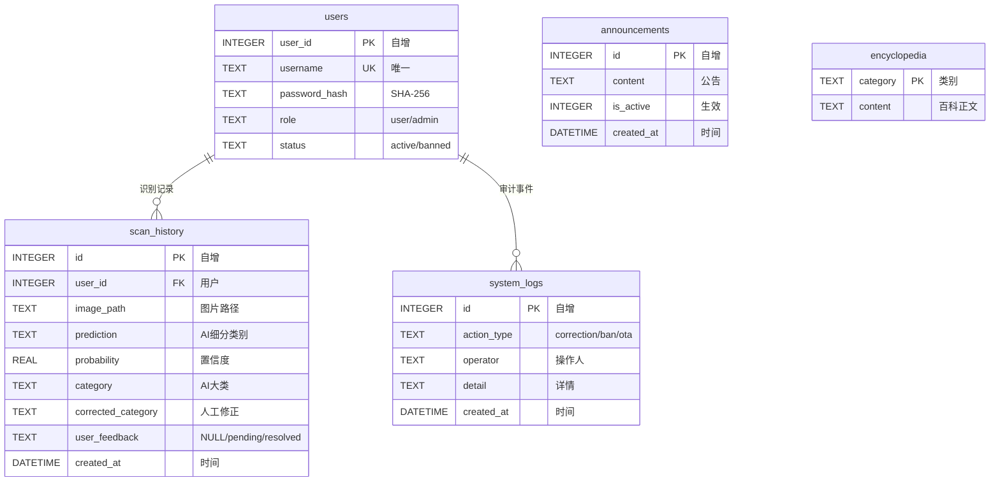

# 数据库 ER 图 — CampusWasteSorting

```mermaid
erDiagram
    users {
        INTEGER user_id PK "自增"
        TEXT username UK "唯一"
        TEXT password_hash "SHA-256"
        TEXT role "user/admin"
        TEXT status "active/banned"
    }

    scan_history {
        INTEGER id PK "自增"
        INTEGER user_id FK "用户"
        TEXT image_path "图片路径"
        TEXT prediction "AI细分类别"
        REAL probability "置信度"
        TEXT category "AI大类"
        TEXT corrected_category "人工修正"
        TEXT user_feedback "NULL/pending/resolved"
        DATETIME created_at "时间"
    }

    system_logs {
        INTEGER id PK "自增"
        TEXT action_type "correction/ban/ota"
        TEXT operator "操作人"
        TEXT detail "详情"
        DATETIME created_at "时间"
    }

    announcements {
        INTEGER id PK "自增"
        TEXT content "公告"
        INTEGER is_active "生效"
        DATETIME created_at "时间"
    }

    encyclopedia {
        TEXT category PK "类别"
        TEXT content "百科正文"
    }

    users ||--o{ scan_history : "识别记录"
    users ||--o{ system_logs : "审计事件"
```
