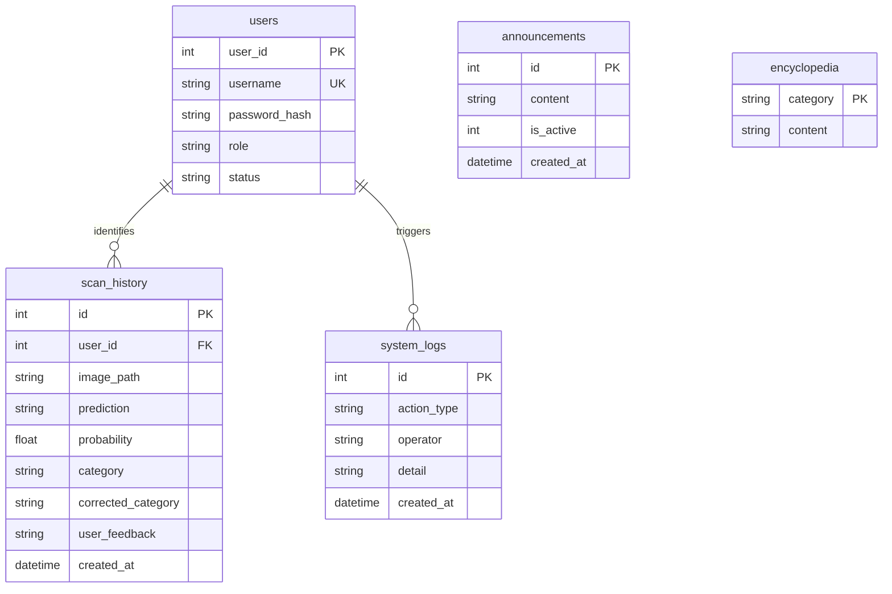

# CampusWasteSorting — ER Diagram

## 1. ER Diagram (Mermaid)



## 2. Table Descriptions

| Table | Description |
|---|---|
| **users** | User auth & role management |
| **scan_history** | Core business records with correction workflow |
| **system_logs** | Audit trail (ban / correction / OTA) |
| **announcements** | System-wide announcements |
| **encyclopedia** | Waste sorting knowledge base CMS |

### scan_history — Correction State Machine

```
NULL (no dispute) → pending (user reported) → resolved (admin corrected)
          ↑                                              │
          └──────────── (user re-disputes) ◄─────────────┘
```
